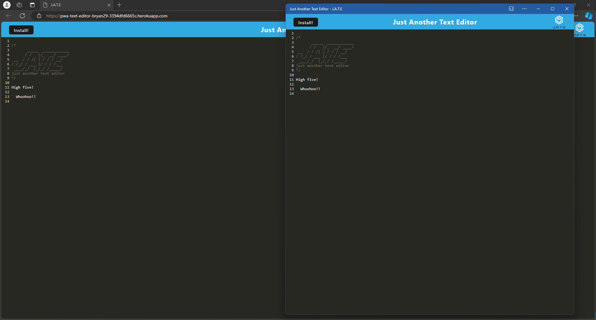
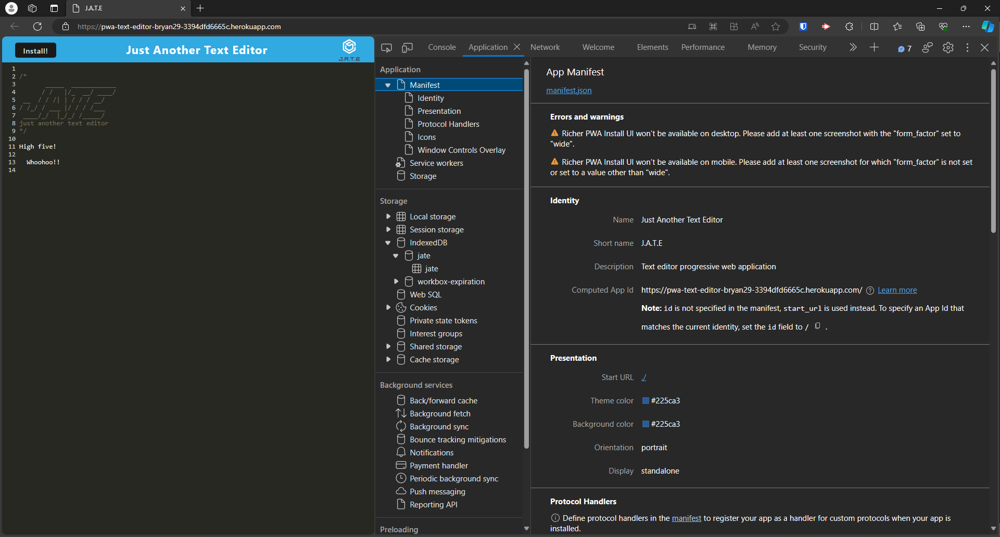
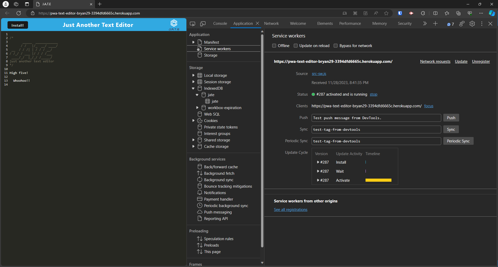
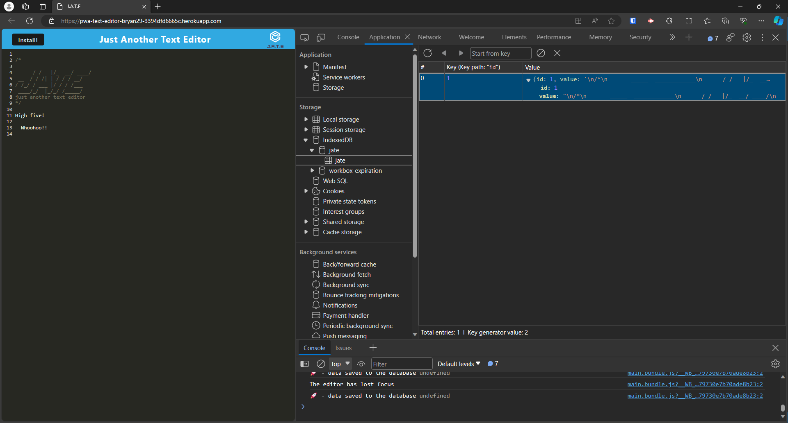

# Progressive Web Applications (PWA): Text Editor
*University of Minnesota - Coding Boot Camp - Module 19 PWA Challenge*

[](https://choosealicense.com/licenses/mit/)

## Description

This single-page application is a text editor that runs in the browser that meets PWA criteria. Additionally, it features a number of data persistence techniques that serve as redundancy in case one of the options is not supported by the browser. The application also functions offline.

## Table of Contents
- [Usage](#usage)
- [Installation](#installation)
- [Credits](#credits)
- [License](#license)

## Usage

#### Deployed Site: https://pwa-text-editor-bryan29-3394dfd6665c.herokuapp.com/
[](https://pwa-text-editor-bryan29-3394dfd6665c.herokuapp.com/)

#### Manifest
[](https://pwa-text-editor-bryan29-3394dfd6665c.herokuapp.com/)

#### Service Worker
[](https://pwa-text-editor-bryan29-3394dfd6665c.herokuapp.com/)

#### IndexedDB Storage
[](https://pwa-text-editor-bryan29-3394dfd6665c.herokuapp.com/)


## Installation 
1. Install [Node.js](https://nodejs.org/) locally
2. Clone or Fork the Repo
3. Open Repo Directory in VS Code Integrated Terminal (or Git Bash)
4. Invoke the following command from a Bash command-line to install dependencies
```bash
npm run install
```
6. Invoke the following command from a Bash command-line to build and test locally
```bash
npm run start:dev
```
7. Invoke the following command from a Bash command-line to build and launch the client environment in production
```bash
npm run start
```


## Credits
- © 2023 edX Boot Camps LLC.


## License

- The content of this application is licensed under the [MIT License](https://choosealicense.com/licenses/mit/)
